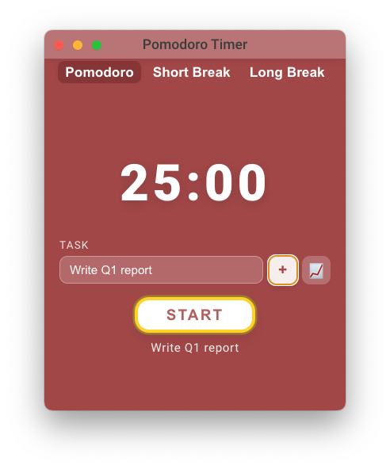

# Pomodoro Timer

<div style="text-align: center;">
  
</div>

Big goals are built in small, focused moments. Pomodoro Timer helps you cut through distractions and turn your to-do list into real progress. 

Pomodoro Timer is heavily inspired by [Pomofocus](https://pomofocus.io/app), and is built with Electron + React + Vite. 

## Current Capabilities

- **Docked window UI**: launches as a fixed-size desktop window (shows in the Dock and can be minimized like a regular app).
- **Timer controls**: 25:00 default countdown with play/pause toggle and automatic reset when the session finishes.
- **Session feedback**: native alert window (shown even when minimized) plus notification on completion.
- **Renderer**: React/Vite timer UI that mirrors the provided mock (red hero background, large digits, centered button).
- **Task input + register**: task name field with a "+" register button and active task label.
- **Session logging**: CSV log file with task, mode, elapsed time, and interruption reason.
- **Log viewer**: in-app 📈 button opens a modal table of recent sessions (newest first).
- **Branding**: minimal rounded red tomato icon for app/dock.
- **Packaging**: `electron-builder` setup emitting unsigned `.app` + `.dmg` artifacts (signing/notarization still manual).

## Tech Stack

- Electron (main process & system tray integration)
- React + Vite + TypeScript (renderer UI)
- electron-builder (packaging)
- ESLint + Prettier + TypeScript project refs

## Prerequisites

- Node.js **22.22.0** (pinned in `.nvmrc`)
- npm 10+/11+ (bundled with Node 22)

## Getting Started

1. Clone and install Node 22.22.0 via `nvm install` (or install manually and match `.nvmrc`).
2. Install all dependencies (root + renderer) with a single command:

   ```bash
   npm install
   ```

   This uses npm workspaces to manage both the Electron main process and the React renderer.

3. Run the desktop app in dev mode:

   ```bash
   npm run dev
   ```

`npm run dev` starts the main/preload TypeScript watchers, the Vite dev server, and Electron once the compiled files exist. A docked Pomodoro window opens automatically when everything is ready.

### Using the timer

1. Click `START` to begin the 25-minute focus block.
2. The button toggles to `PAUSE`; click it again to pause/resume.
3. Enter a task name, click `+` to register it, and the label appears below the button.
4. Use the 📈 button to view the log table in a modal.
5. When the timer reaches `00:00`, the window resets to `25:00`, and a native alert appears (even if minimized), plus a notification.
6. Start again whenever you’re ready.

## Logging

Sessions are logged to a CSV file for plotting and analysis. A log entry is written whenever the timer stops or resets: pause, tab change, completion, or app exit.

**Log path (cross-platform):**

- macOS: `~/Library/Application Support/Pomodoro Timer/logs/pomodoro-log.csv`
- Windows: `%APPDATA%\Pomodoro Timer\logs\pomodoro-log.csv`
- Linux: `~/.config/Pomodoro Timer/logs/pomodoro-log.csv`

**CSV columns:**

`timestamp_start,timestamp_end,task,mode,elapsed_seconds,completed,interrupted,end_reason`

## Building a macOS DMG

1. Ensure dependencies are installed (see steps above).
2. From the repo root run:

   ```bash
   npm run build
   ```

This runs the renderer build, compiles the Electron main + preload bundles, and calls `electron-builder`. Artifacts land in `release/` (configurable via `build/electron-builder.yml`). Signing/notarization is not set up yet; add `CSC_IDENTITY_AUTO_DISCOVERY=true` and Apple credentials when you’re ready to distribute.

## Installation (macOS)

1. Open the generated DMG from `release/`.
2. Drag `Pomodoro Timer.app` into the Applications folder.
3. Launch from Applications. If macOS warns about an unsigned app, use System Settings → Privacy & Security → Open Anyway.

## Installation (Windows)

1. Build or obtain a Windows installer (`.exe` or `.msi`) from your build pipeline.
2. Run the installer and follow the prompts.
3. If Windows SmartScreen warns about an unsigned app, choose “More info” → “Run anyway”.

## Installation (Linux)

1. Build or obtain a Linux package (`.AppImage`, `.deb`, or `.rpm`).
2. For AppImage: mark as executable (`chmod +x Pomodoro-Timer.AppImage`) and run it.
3. For `.deb`/`.rpm`: install using your package manager (`sudo dpkg -i` or `sudo rpm -i`).

Folder highlights:

- `dist/main` → compiled Electron main process output
- `dist/preload` → compiled preload bridge
- `dist/renderer` → Vite renderer bundle consumed by Electron
- `release/` → unsigned `.app` + `.dmg` outputs

## Project Structure

```
app/
  main/       # Electron window creation + notification wiring
  preload/    # IPC bridge exposing timerComplete()
  renderer/   # React/Vite UI for the Pomodoro timer
assets/
  icons/      # App/dock/tray icons for packaging
build/
  electron-builder.yml
.nvmrc        # Node version pin (22.22.0)
.npmrc        # engine-strict to ensure Node compatibility
.editorconfig / .eslintrc.cjs / .prettierrc  # lint & format baseline

## Troubleshooting

- `npm use` is not a valid command. Use `nvm use` (Node Version Manager) or install Node 22 manually (e.g., `brew install node@22` and export `PATH="/usr/local/opt/node@22/bin:$PATH"`).
- `npm install` `EBADENGINE` errors indicate you’re on Node 16/npm 8. Switch to Node 22.22.0 and reinstall.
- Blank renderer window in dev? Ensure `dist/main/main.js` and `dist/preload/index.js` exist (`npm run build:main && npm run build:preload`), then restart `npm run dev`.
- Seeing Vite’s preview page instead of the Electron window? Run `npm run dev` from the repo root so Electron launches alongside Vite.
- Notifications not showing? macOS may block the first notification—open System Settings → Notifications → Pomodoro Timer and allow alerts.
```

## Implementation Notes (Current State)

### Window & UI

- The application uses a **frameless Electron window** (`frame: false`, `transparent: true`) for custom top bar and modern glass effect.
- **Resizable**: The window is resizable (`resizable: true` in BrowserWindow options), and all UI scales fluidly.
- **main-bg**: The main content area is a single root container (class `.main-bg`) that fills the entire window (`width: 100vw; height: 100vh;`) and ensures no space or content falls outside it. The border-radius is currently set to `0px` to avoid issues with black/transparent corners caused by window shape rendering; restorations or tweaks are possible.
- **Glass effect**: The background uses CSS `backdrop-filter: blur(18px);` and a semi-transparent fill. You can change color, alpha, and blur via `.main-bg` in App.css.

### Scaling Behavior

- Content (timer, button, top bar) uses `clamp()` and `vw/vh` units for responsive font sizes, widths, and layout, supporting smooth scaling.
- Flexbox is used to align and scale elements within the main-bg, ensuring they stay centered/positioned as the window resizes.

### Top Bar / Controls

- The top bar (custom title bar) is rendered as part of `.main-bg`, not outside; it mimics native macOS, Windows, or Linux controls using SVG for cross-platform consistency.
- Control buttons are wired to Electron's window APIs via IPC (see preload and main process handling for `window-control` channel).

### Implementation Tradeoffs

- No drop shadow is applied to the main window.
- true glassy corners (card-like) are not visually practical with transparent custom Electron windows; using `border-radius: 0` guarantees that all edges are perfectly flush (no black corners). If you want to try bringing back rounded corners, you can simply update the border-radius in CSS, accepting the tradeoff.
- The app is designed to be cross-platform modern and maintainable. Resizing, glass/blur, and scaling work on Mac, Windows, and Linux with minor platform style shifts (titlebar, controls).

### How to continue

- To change color, glass/blur strength, or border-radius: edit `.main-bg` in `app/renderer/src/App.css`.
- To adjust scaling, refine clamp/vw/vh units in the timer/button/titlebar styles in CSS.
- To add more features (preferences, menu, durations), follow the roadmap below.

## Roadmap Snapshot

- [x] Docked window with timer UI/logic
- [x] Native notification + audible alert on completion
- [ ] Configurable focus + break durations
- [ ] Menu-bar status indicator / countdown
- [ ] Native notifications for focus/break transitions (break cycles)
- [ ] Persisted preferences/settings window
- [ ] Windows + Linux targets in `electron-builder`
- [ ] macOS signing + notarization automation

Use this README as a living snapshot when adding features; update sections above as the app evolves.
